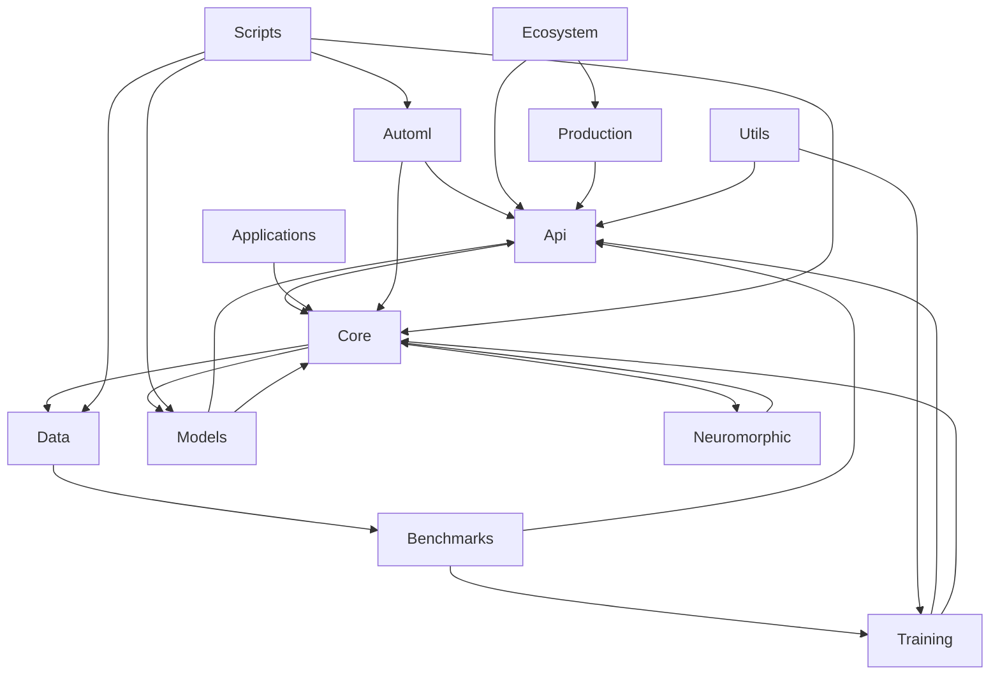

# Phase 0 - Module Dependency Analysis

## Internal Module Dependencies

- **Total Modules**: 13
- **Total Internal Dependencies**: 24
- **Average Dependencies per Module**: 1.8

## Most Depended-On Modules

- **core**: 7 modules depend on it
- **api**: 7 modules depend on it
- **models**: 2 modules depend on it
- **data**: 2 modules depend on it
- **training**: 2 modules depend on it

## Modules with Most Dependencies

- **scripts**: depends on 4 modules
  - Dependencies: automl, core, data, models
- **core**: depends on 3 modules
  - Dependencies: data, models, neuromorphic
- **models**: depends on 2 modules
  - Dependencies: api, core
- **training**: depends on 2 modules
  - Dependencies: api, core
- **utils**: depends on 2 modules
  - Dependencies: api, training

## Dependency Graph (Simplified)

## Detailed Module Dependencies

### api
**Depends on**:
- core

### applications
**Depends on**:
- core

### automl
**Depends on**:
- api
- core

### benchmarks
**Depends on**:
- api
- training

### core
**Depends on**:
- data
- models
- neuromorphic

### data
**Depends on**:
- benchmarks

### ecosystem
**Depends on**:
- api
- production

### models
**Depends on**:
- api
- core

### neuromorphic
**Depends on**:
- core

### production
**Depends on**:
- api

### scripts
**Depends on**:
- automl
- core
- data
- models

### training
**Depends on**:
- api
- core

### utils
**Depends on**:
- api
- training

## External Dependencies

Key external packages used throughout the system:
- **torch**: Deep learning framework (core functionality)
- **numpy**: Numerical computing (data processing)
- **scipy**: Scientific computing (advanced algorithms)
- **pyyaml**: Configuration management
- **rich**: CLI output formatting
